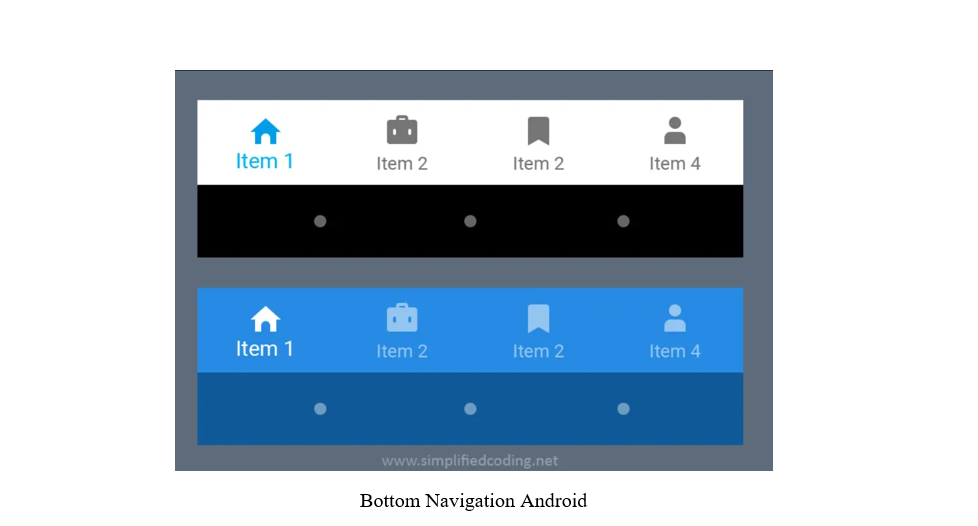

# BOTTOM NAVIGATION ANDROID
In Android, there are many options for making navigation easy in your application for the user. Bottom Navigation Bar is one of them. Bottom Navigation Bar always stays at the bottom of your application and provides navigation between the views of your application.

<p align="center">
  
</p>

## Using Bottom Navigation in Android

It is very easy, you can create a Bottom Navigation Activity in your project by following ways.

1. you just need to use <android.support.design.widget.BottomNavigationView />, if you want to do it in XML.

2. Android Studio also have a predefined template for creating BottomNavigationView, when you create a new Activity you can select Bottom Navigation Activity, as shown in the image.
<p align="center">
  
</p>

3. While creating an Android Project you can select Bottom Navigation Activity from the template.

<p align="center">
  
</p>

## Bottom Navigation Android Example

Now lets see everything in an Android Project.

## Defining Colors and Strings

•	I have created a project named BottomNavigationExample using a Bottom Navigation Activity. You can choose Empty Activity, it will not make any difference.

•	Now first, we will define the colors. You can change the colors to anything you want. So define the following in your colors.xml.
```
<?xml version="1.0" encoding="utf-8"?>
<resources>
    <color name="colorPrimary">#278be3</color>
    <color name="colorPrimaryDark">#0f5998</color>
    <color name="colorAccent">#4075a2</color>
    <color name="colorNavIcon">#dae9f6</color>
    <color name="colorNavText">#01294b</color>
</resources>
```
•	Now come to strings.xml and define the following strings.

```
<resources>

    <string name="app_name">Bottom Navigation Android Example</string>

    <string name="title_home">Home</string>
    <string name="title_dashboard">Dashboard</string>
    <string name="title_notifications">Notifications</string>
    <string name="title_profile">Profile</string>
    
</resources>
```
## Customizing Bottom Navigation View

•	Now come to activity_main.xml and modify it as shown below.

```
<?xml version="1.0" encoding="utf-8"?>
<android.support.constraint.ConstraintLayout xmlns:android="http://schemas.android.com/apk/res/android"
    xmlns:app="http://schemas.android.com/apk/res-auto"
    xmlns:tools="http://schemas.android.com/tools"
    android:id="@+id/container"
    android:layout_width="match_parent"
    android:layout_height="match_parent"
    tools:context="net.simplifiedcoding.bottomnavigationexample.MainActivity">

    <FrameLayout
        android:id="@+id/fragment_container"
        android:layout_width="match_parent"
        android:layout_height="match_parent"
        android:layout_marginBottom="56dp"
        android:text="@string/title_home"
        app:layout_constraintLeft_toLeftOf="parent"
        app:layout_constraintTop_toTopOf="parent" />

    <android.support.design.widget.BottomNavigationView
        android:id="@+id/navigation"
        android:layout_width="0dp"
        android:layout_height="wrap_content"
        android:background="@color/colorPrimary"
        app:itemIconTint="@color/colorNavIcon"
        app:itemTextColor="@color/colorNavText"
        app:layout_constraintBottom_toBottomOf="parent"
        app:layout_constraintLeft_toLeftOf="parent"
        app:layout_constraintRight_toRightOf="parent"
        app:menu="@menu/navigation" />

</android.support.constraint.ConstraintLayout>
```

Remember for <android.support.design.widget.BottomNavigationView />we can use the following properties.

•	app:itemIconTint : for defining the Item Icon color.

•	app:itemTextColor : for defining the Item Text Color.

•	android:background : for defining the Bottom Navigation View background.

•	app:menu : for defining the menu that we need to display in the Bottom Navigation View.

Now, if you created the project using Bottom Navigation Activity template, a menu file named navigation.xml is created by default inside the menu folder. If it is not created you can create it manually as well. Here we define all the menu items that we need to display in the Bottom Navigation Bar.

```
<?xml version="1.0" encoding="utf-8"?>
<menu xmlns:android="http://schemas.android.com/apk/res/android">

    <item
        android:id="@+id/navigation_home"
        android:icon="@drawable/ic_home_black_24dp"
        android:title="@string/title_home" />

    <item
        android:id="@+id/navigation_dashboard"
        android:icon="@drawable/ic_dashboard_black_24dp"
        android:title="@string/title_dashboard" />

    <item
        android:id="@+id/navigation_notifications"
        android:icon="@drawable/ic_notifications_black_24dp"
        android:title="@string/title_notifications" />

    <item
        android:id="@+id/navigation_profile"
        android:icon="@drawable/ic_profile_black_24dp"
        android:title="@string/title_profile" />

</menu>
```

•	So, the above codes will produce the following Layout for our Main Activity.


