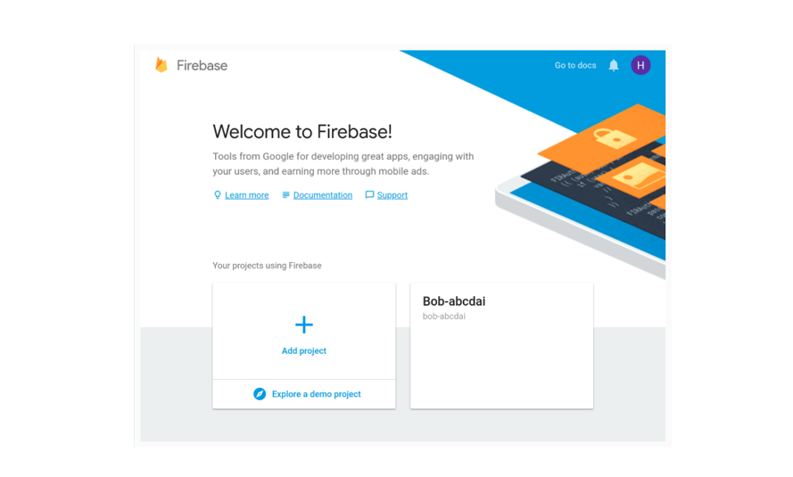

# FIREBASE ML KIT FOR ANDROID

Firebase ML Kit is a library that allows you to effortlessly, and with minimal code, use a variety of highly accurate, pre-trained deep models in your Android apps. Most of the models it offers are available both locally and on the Google Cloud.

Currently, the models are limited to computer-vision-related tasks only, such as optical character recognition, barcode scanning, and object detection.

## how to add Firebase ML Kit to an Android Studio project and use some of its base APIs?

## Prerequisites:

Before you proceed, make sure you have access to the following:

•	the latest version of Android Studio 

•	a device or emulator running Android API level 21 or higher

•	a Firebase account

•	a Google Cloud account.

## 1.Create a Firebase Project

To enable Firebase services for your app, you must create a Firebase project for it. So log in to the Firebase console and, on the welcome screen, press the Add project button.

  

•	In the dialog that pops up, give the project a name that's easy to remember and press the Create project button.

  

•	After several seconds, you should see a notification telling you that the new project is ready. Press the Continue button to proceed.

•	In the next screen, go to the Develop section and click on the ML Kit link to see all the services ML Kit offers.

  

•	In this , we'll be using three services: text recognition, face detection, and image labeling. You don't have to take any steps to explicitly enable them if you intend to work with only the local models that come with ML Kit. In this tutorial, though, we'll be using both local and cloud-based models. So click on the Cloud API usage link next.

•	You'll now be taken to the Google Cloud console, where you can simply press the Enable button shown in the Cloud Vision API section to activate the cloud-based models. Note, however, that this will work only if you have billing enabled for your Google Cloud account.

  

