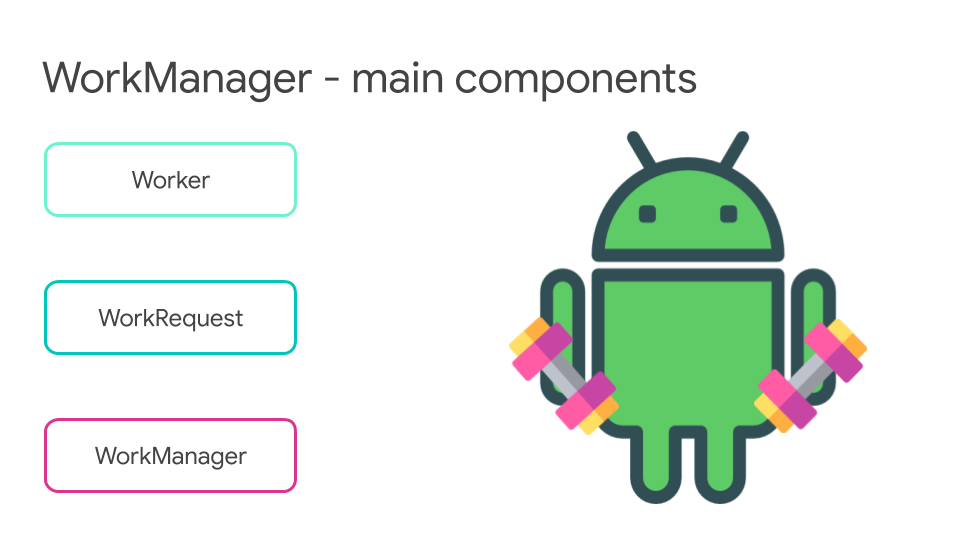
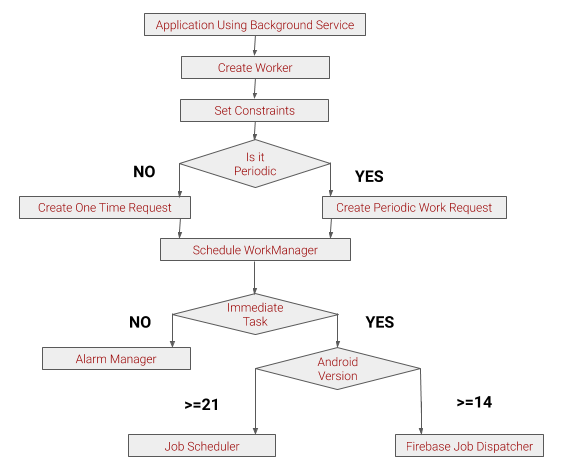

# WorkManager
### What is a WorkManager :
WorkManager is a library used to enqueue deferrable work that is guaranteed to execute sometime after its Constraints are met. WorkManager allows observation of work status and the ability to create complex chains of work.

### Why is a WorkManager :
* To optimise the battery consumption.
* To maintain the background work correctly without affecting the processing speed
* Deferrable and Guaranteed background work.
* To get rid of the boilerplate code. 
* Backwards Compatible up to API 14
  * Uses JobScheduler on devices with API 23+
  * Uses a combination of BroadcastReceiver + AlarmManager on devices with API 14 - 22

### Components of WorkManager :
* Below image represents all the three components of WorkManager :

1.Worker: The main class where we will put the work that needs to be done.
2.WorkRequest: It defines an individual task, like it will define which worker class should execute the task.
3.WorkManager: The class used to enqueue the work requests.

### Scheduling WorkManager :
* Below Graph represents the flow of WorkManager :

